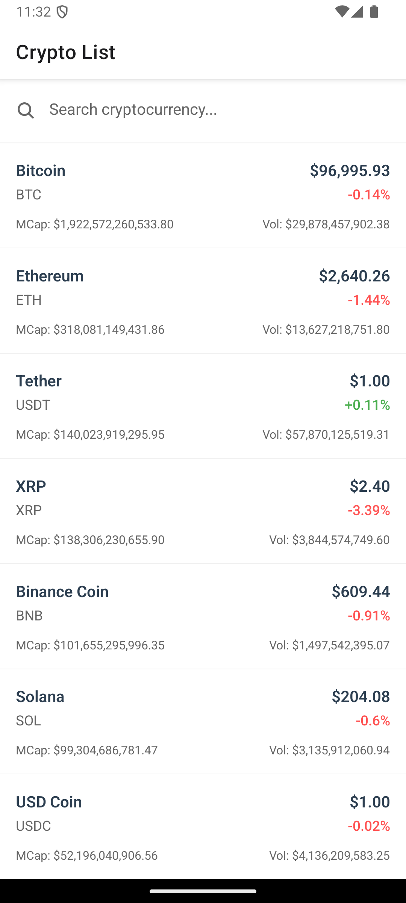
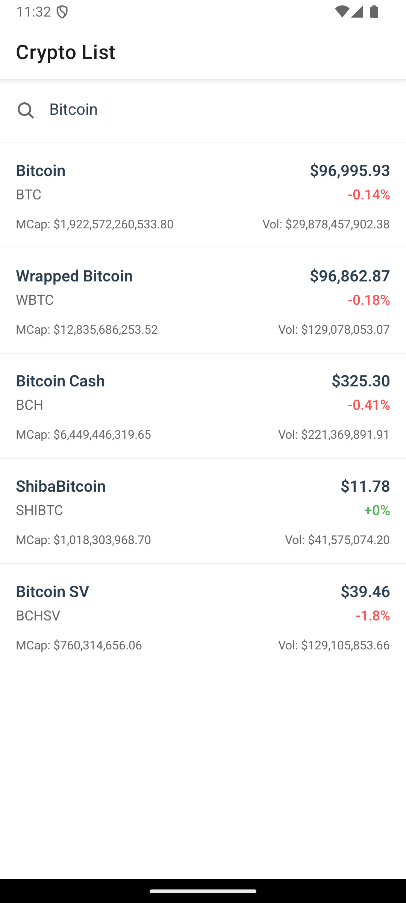
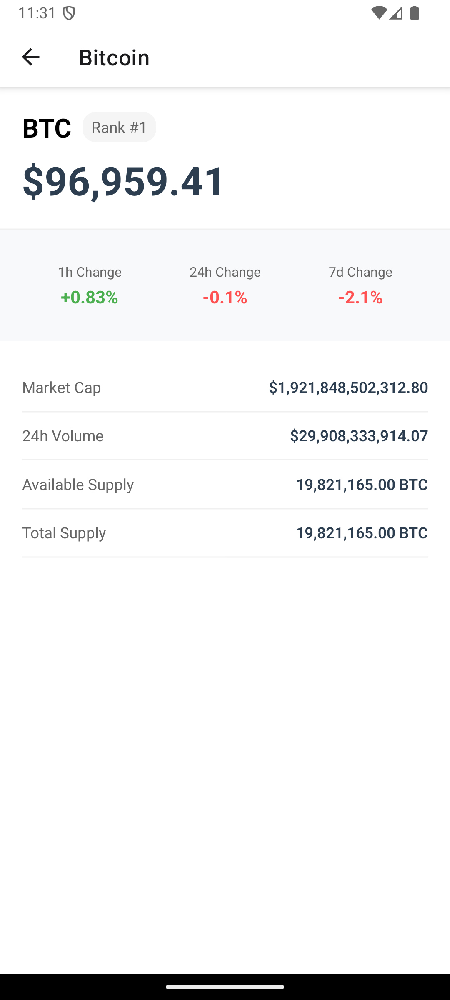

# Crypto List App

Aplicación móvil que muestra información en tiempo real de criptomonedas y su cambio a USD, desarrollada para una empresa inmobiliaria.

## Screenshots

### Lista Principal y Búsqueda
<div style="display: flex; gap: 10px;">
  
  
</div>

### Vista Detallada


## Requerimientos Técnicos Implementados

### Tecnologías Base
- ✅ TypeScript
- ✅ React Native
- ✅ Soporte para iOS y Android

### Arquitectura y Estructura
- Patrón de Arquitectura Orientada a Objetos (OOP)
- Servicios encapsulados para manejo de API
- Modelos de datos tipados
- Separación de responsabilidades (Components, Containers, Services)

### Mejores Prácticas
- Clean Code
- SOLID Principles
- Custom Hooks para lógica reutilizable
- Manejo de errores centralizado
- Formateo consistente de números y porcentajes

### Performance
- Lazy loading de imágenes
- Memoización de componentes
- Optimización de re-renders

### Testing
- Tests unitarios con Jest
- Tests de integración con React Testing Library
- Cobertura de componentes principales

## Funcionalidades

1. Lista de Criptomonedas
   - Visualización de precios en USD
   - Capitalización de mercado
   - Volumen de trading

2. Filtrado
   - Búsqueda por nombre de criptomoneda
   - Actualización en tiempo real

3. Vista Detallada
   - Estadísticas completas
   - Cambios porcentuales (1h, 24h, 7d)
   - Supply information

## Instalación y Ejecución

1. Clonar el repositorio:
```bash
git clone [URL_REPOSITORIO]
cd crypto-list
```

2. Instalar dependencias:
```bash
npm install
```

3. Iniciar la aplicación:
```bash
npx expo start
```

4. Ejecutar tests:
```bash
npm test
```

## API Utilizada

Se utiliza la API de CoinLore para obtener la información de criptomonedas:
- Endpoint principal: `https://api.coinlore.net/api/tickers/`
- Documentación: [CoinLore API](https://www.coinlore.com/cryptocurrency-data-api)

## Estructura del Proyecto

```
/src
  /components      # Componentes reutilizables
  /containers      # Componentes contenedores
  /domain
    /models        # Interfaces y tipos
    /services      # Servicios de API (OOP)
  /hooks           # Custom hooks
  /utils           # Utilidades
/app               # Rutas de la aplicación
/__test__         # Tests
```

